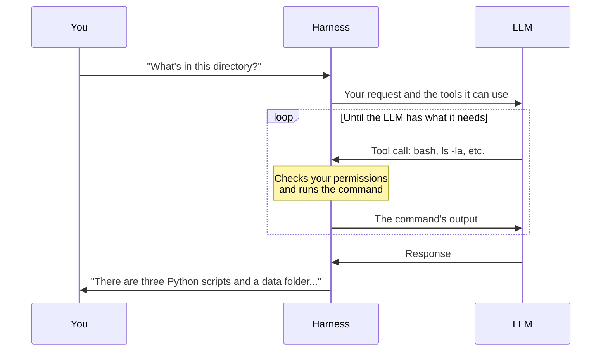

# OpenCode

OpenCode is a harness, the program half of a coding agent%, and it runs in your terminal or code editors such as VS Code. You describe what you want in plain language, such as "write a Slurm% job script for this training run" or "why does this script crash?", and it reads your files, proposes changes and, if you allow it, edits code and runs commands.

It is one of many harnesses, and the one the LUMI AI Factory provides ready to use on LUMI, in a container%. You can also install it on your own machine.

## How an agent works

An agent has two parts: the LLM%, which decides what to do, and the harness, which carries it out. You may hear people call the harness itself an agent, but on this site "agent" always means the two together. The harness sends the LLM your request along with a description of the tools it can use, such as reading files, editing code or running commands.

The LLM itself can only write text. To use a tool, it writes text in a fixed format that it was trained to use for tool calls. The exact format differs between LLMs; with many Qwen models, a request to list the files in your directory looks something like this:

```
<tool_call>
{"name": "bash", "arguments": {"command": "ls -la"}}
</tool_call>
```

The harness recognises this as a tool call, checks that it is valid and that your permissions allow it, runs the tool and passes the result back to the LLM, which carries on from there. This is what tool calling means, and why a harness needs an LLM that was trained to do it reliably.



## Why OpenCode

OpenCode works much like Anthropic's Claude Code or OpenAI's Codex, but it is not tied to any AI company: it is open source% and works with LLMs from almost any provider. This page connects it to Aitta, which keeps your prompts on LUMI, but you can just as well use GPT, Claude or other LLMs through an account with their provider, and switch between them without learning a new tool.

You do not need OpenCode to use the rest of the LUMI agent ecosystem either. Aitta works with most harnesses that support OpenAI-compatible providers, as explained in the [previous chapter](/01_aitta). Claude Code does not: it works only with Anthropic's API% and cannot connect to Aitta directly. It can still use the LUMI MCP% server, as can Codex and most other harnesses, as the next chapter explains.

## Before you start: what not to do

An agent acts on your behalf: every command it runs is executed under your own user account, and you are responsible for it, not the agent. Read the [AI agent guide](https://docs.lumi-supercomputer.eu/development/ai-tools/ai-agent-guide/) before your first session. Its most important points:

> [!warning] Using agents on LUMI
> - **Stay in charge.** Monitor your agent actively and avoid running more than one.
> - **Save often.** If a login node becomes unstable, agent processes may be stopped without notice. Save your work frequently and do not rely on long, unsupervised sessions.
> - **Protect your work.** Agents can change, overwrite or delete files without asking, and LUMI's file systems are not backed up. Use version control or keep backups. Instead of letting the agent run Git commands, ask it which commands to run and run them yourself.
> - **Keep it contained.** Run the harness in a container to limit which files the agent can reach, and never run it with elevated privileges (on your own machine, for example with `sudo` or as an administrator).
> - **Mind the shared system.** Agents may submit jobs, spawn runaway loops or query Slurm over and over, which affects everyone on LUMI. Check any job settings the agent suggests against the LUMI documentation. Disruptive processes may be terminated.
> - **No sensitive data.** Never process sensitive or confidential data with an agent. Use synthetic data instead.
> - **Guard your credentials.** Never give access to your password, SSH key or any other credential to an agent running on a third-party system, such as an online chatbot or a cloud-based IDE.

Running a harness on a login node% is allowed. Login nodes are shared by all LUMI users and meant for light tasks: the agent can write and edit code there, but compute-heavy work belongs on compute nodes% through Slurm.

## OpenCode on LUMI

The LUMI AI Factory provides OpenCode in a container set up for LUMI, described in full in the [agent infrastructure docs](https://docs.lumi-supercomputer.eu/laif/software/agent-infrastructure/). Log in to LUMI, go to the directory you want to work in and start OpenCode:

```bash
module load Local-LAIF lumi-aif-agents
opencode
```

The container already connects OpenCode to Aitta and the LUMI MCP server, so all that is left is to add your API token% and pick one of Aitta's LLMs before your first prompt:

1. Type `/connect` and search for `aitta` as the provider.
2. Paste your API token from [Aitta](/01_aitta).
3. Select the desired LLM from the list that appeared or type `/models`.


OpenCode saves the API token in your home directory, which only you can see, so you only need to add it again (`/connect`) when it expires after 90 days.

Compared with a plain install of OpenCode, the container:

- **Asks before every action.** Its default configuration asks your permission before using any tool, even for reading a file. The only exception is the tools of the LUMI MCP server. When it asks, you can choose to always allow that kind of action for the rest of the session.
- **Knows a little about LUMI.** It gives the agent [a short set of instructions](https://github.com/lumi-ai-factory/laifs-agent-env/blob/main/config/AGENTS.md) about working on LUMI, such as what login nodes are for and how to go easy on LUMI's shared file system.
- **Only sees your current directory.** The agent can reach the working directory% you start it in and everything below it, but not the rest of your home directory or your other project directories.
- **Cannot use Slurm.** Slurm commands are not available inside the container, so the agent cannot submit or monitor jobs. It can still write a job script for you to check and submit yourself.


If an Aitta LLM you want is missing from the list, you can add it by dropping your own `opencode.json` in `~/.config/opencode/`, like the one [for your own machine](#opencode-on-your-own-machine) below.

<details>
<summary>Optional: give the agent access to more directories</summary>

Add the directories to `SINGULARITY_BIND` after loading the module and before starting OpenCode. For example, to work on code in your project directory and let the agent also read your data on `/scratch` (replace `project_462000000` with your own project):

```bash
cd /project/project_462000000/my-code
module load Local-LAIF lumi-aif-agents
export SINGULARITY_BIND=$SINGULARITY_BIND,/scratch/project_462000000/data
opencode
```

Separate several directories with commas. Keep `$SINGULARITY_BIND,` at the start, because the module has already put LUMI's software directory there.

</details>

## OpenCode on your own machine

On macOS or Linux, the quickest way to install OpenCode is the official install script:

```bash
curl -fsSL https://opencode.ai/install | bash
```

For Windows and other options, such as npm, Homebrew and Docker, see the [OpenCode installation guide](https://opencode.ai/docs/).

Out of the box, OpenCode uses OpenCode Zen, a model service run by the company that maintains OpenCode, so everything you type and every file the agent reads is sent to that company. To add Aitta and the LUMI MCP server instead, download this configuration and save it as `~/.config/opencode/opencode.json`, or open the section below to copy it:

[opencode.json](./assets/opencode.json)

<details>
<summary>Show the contents of opencode.json</summary>

```json title="~/.config/opencode/opencode.json"
{
  "$schema": "https://opencode.ai/config.json",
  "model": "aitta/Qwen/Qwen3.6-27B",
  "permission": {
    "bash": "ask",
    "edit": "ask",
    "webfetch": "ask",
    "websearch": "ask"
  },
  "mcp": {
    "lumi-aif": {
      "type": "remote",
      "url": "https://lumi-aif-agents.2.rahtiapp.fi/mcp",
      "enabled": true
    }
  },
  "provider": {
    "aitta": {
      "npm": "@ai-sdk/openai-compatible",
      "name": "Aitta",
      "options": {
        "baseURL": "https://aitta-api.csc.fi/openai/v1"
      },
      "models": {
        "openai/gpt-oss-120b": { "name": "openai/gpt-oss-120b" },
        "Qwen/Qwen3-Coder-Next": { "name": "Qwen/Qwen3-Coder-Next" },
        "Qwen/Qwen3.6-35B-A3B": { "name": "Qwen/Qwen3.6-35B-A3B" },
        "Qwen/Qwen3.6-27B": { "name": "Qwen/Qwen3.6-27B" },
        "Qwen/Qwen3-VL-30B-A3B-Thinking": { "name": "Qwen/Qwen3-VL-30B-A3B-Thinking" },
        "MiniMaxAI/MiniMax-M2.7": { "name": "MiniMaxAI/MiniMax-M2.7" },
        "google/gemma-4-31b-it": { "name": "google/gemma-4-31b-it" },
        "google/gemma-4-26B-A4B-it": { "name": "google/gemma-4-26B-A4B-it" },
        "mistralai/Ministral-3-14B-Reasoning-2512": { "name": "mistralai/Ministral-3-14B-Reasoning-2512" },
        "meta-llama/Llama-3.3-70B-Instruct": { "name": "meta-llama/Llama-3.3-70B-Instruct" },
        "LumiOpen/Llama-Poro-2-70B-Instruct": { "name": "LumiOpen/Llama-Poro-2-70B-Instruct" },
        "swiss-ai/Apertus-70B-Instruct-2509": { "name": "swiss-ai/Apertus-70B-Instruct-2509" },
        "swiss-ai/Apertus-8B-Instruct-2509": { "name": "swiss-ai/Apertus-8B-Instruct-2509" }
      }
    }
  }
}
```

</details>

What the file does:

- **`model`** makes Qwen3.6-27B on Aitta the default LLM.
- **`permission`** decides what the agent may do without asking you first (see below).
- **`mcp`** connects the [LUMI MCP server](/03_mcp_server), so the agent can look things up in the LUMI documentation and check LUMI's status.
- **`provider`** adds Aitta as a source of LLMs: its address and the LLMs you can pick from.
- **`models`** lists every LLM on Aitta that supports tool calling (as of September 2026). Aitta's selection changes over time, so you may need to add or remove entries. The [previous chapter](/01_aitta#three-steps-to-connect) shows how to list the models currently available on Aitta.

Then go to your project directory, run `opencode` and add your API token:

1. Type `/connect` and search for `aitta` as the provider.
2. Paste your API token from [Aitta](/01_aitta).
3. Start prompting. Qwen3.6-27B should be already selected; type `/models` to pick another LLM.

### What the agent can do without asking

With this configuration, the agent goes ahead on its own when it only looks at things, and asks first whenever it could change something or reach beyond the directory you started it in:

| Without asking | Asks first |
|:---------------|:-----------|
| Reading and searching files in the directory you started it in | Running commands |
| Looking things up with the LUMI MCP server | Creating, changing or deleting files |
| Planning its work, asking you questions and handing parts of a task to helper agents | Fetching web pages and searching the web |
| | Touching files outside the directory you started it in |

Reading and searching cannot change anything, so asking every time would mostly just slow you down. Commands can do anything your account can, file changes can destroy work, and web pages can contain hidden instructions that take over the agent (prompt injection), so these wait for your approval. OpenCode also blocks reading `.env` files, which often hold passwords, and asks if the agent repeats the same action three times in a row.

### Keeping it contained

On your own machine, the agent is not locked into your project directory. OpenCode asks before it opens files elsewhere, but a command you approve runs as you and can reach all your files, such as your documents or your SSH keys. A container makes sure the agent can only reach the directories you choose, which is why the AI agent guide recommends running the harness in a container. OpenCode offers an official Docker image for this (see the Docker option in the [OpenCode installation guide](https://opencode.ai/docs/)), and Docker's guide to [bind mounts](https://docs.docker.com/engine/storage/bind-mounts/) shows how to give the container access to just your project directory.

> [!info] In development: Slurm for agents on your own machine
> The LUMI AI Factory is developing a FirecREST API for LUMI, which will let a harness on your own machine run Slurm commands on LUMI. You log in, get an access token, and the harness uses it to connect to the API as you.

## Knowledge check

```quiz
title: Check your understanding

Q: On LUMI, you start OpenCode and send a prompt before picking an LLM. Where does it go?
- [ ] To Aitta, on LUMI's own hardware
- [x] To OpenCode Zen, a service run by the company that maintains OpenCode
- [ ] Nowhere, OpenCode refuses to answer
> The container does not pick an LLM for you, so OpenCode uses its default, OpenCode Zen.

---

Q: On your own machine, with the configuration on this page, which of these does the agent do without asking? (select all)
- [x] Reading a file in the directory you started it in
- [x] Searching the LUMI documentation through the MCP server
- [ ] Running a command
- [ ] Fetching a web page
> Reading files and searching the LUMI documentation cannot change anything. Commands, file changes and web access wait for your approval.

---

Q: Your agent has written a Slurm job script. What happens next?
- [ ] The agent submits it from inside the container
- [x] You check it against the LUMI documentation and submit it yourself
> Slurm is not available inside the container, and the AI agent guide asks you to check any job settings an agent suggests.
```
