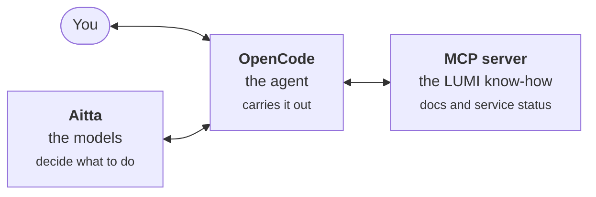

# LUMI Agent Ecosystem

An AI agent can take on everyday coding work for you, such as writing a job script, tracking down a bug or explaining an error message. Unlike a chatbot where you copy code back and forth, an agent works with your files and terminal directly. The LUMI AI Factory lets your agent use open-weight LLMs% running on LUMI's GPUs and look things up in the LUMI documentation, whether the agent itself runs on LUMI or on your own computer. This site shows how the pieces fit together and points you to the right guide for each step.

## The three pieces

They work well together, but each one also works on its own, so you can pick only the ones you need.

### Aitta: the models

Aitta is an inference platform%, like the ones OpenAI and Anthropic run, except that its models are open-weight LLMs running on LUMI's GPU nodes. You can chat with them in your browser or connect to them through an API%, and your prompts are processed on LUMI's own hardware instead of being sent to a commercial provider. The API is OpenAI-compatible, so most agents and tools built to work with OpenAI can use Aitta too.

[Read about Aitta](/02_aitta)

### OpenCode: the agent

OpenCode is a coding agent% that works in your terminal, much like Anthropic's Claude Code or OpenAI's Codex. Unlike those, it is not tied to any AI company: it is open source% and works with LLMs from almost any provider, including Aitta. It uses the LLM you choose to plan, write and edit code, and to run commands if you allow it. On LUMI it comes ready to use in a container, and you can also install it on your own machine.

[Set up OpenCode](/03_opencode)

### The MCP server: the LUMI know-how

An LLM only knows what it learned during training, and that rarely includes up-to-date details about LUMI. The LUMI AI Factory MCP% server lets your agent search the LUMI documentation and check whether anything on LUMI is down or under maintenance, so its answers are based on current information rather than guesswork. It works with Claude Code, Codex and most other coding agents too, not only OpenCode.

[Connect the MCP server](/04_mcp_server)

## Where to start

- **New to all of this?** Start with [the basics](/01_intro): how AI models are served, what coding agents do and what an MCP server is, in plain words.
- **Just want it running?** Get an API token from [Aitta](/02_aitta), copy the ready-made `opencode.json` from the [OpenCode page](/03_opencode), then add the [MCP server](/04_mcp_server).