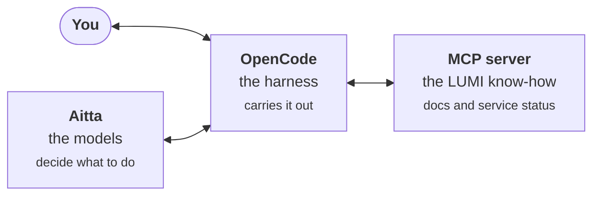

# LUMI Agent Ecosystem

An AI agent can take on everyday coding work for you, such as writing a job script, tracking down a bug or explaining an error message. Unlike a chatbot where you copy code back and forth, an agent works with your files and terminal directly.

An agent has two parts: an LLM% that decides what to do, and a program called the harness that carries it out, reading files, editing code and running commands, in your terminal or your code editor. You may hear people say "agent" when they mean just the harness, but on this site we keep the two apart: the agent is the whole package including the LLM, and the harness is the program itself.

The LUMI AI Factory lets your agent use open-weight LLMs running on LUMI's GPUs% and look things up in the LUMI documentation, whether the harness runs on LUMI or on your own computer. This site shows how the pieces fit together and points you to the right guide for each step.

## The three pieces

They work well together, but each one also works on its own, so you can pick only the ones you need.

### Aitta: the models

Aitta is an inference platform%, like the ones OpenAI and Anthropic run, except that its models are open-weight LLMs running on LUMI's GPU nodes. You can chat with them in your browser or connect to them through an API%, and your prompts are processed on LUMI's own hardware instead of being sent to a commercial provider. The API is OpenAI-compatible, so most harnesses and tools built to work with OpenAI can use Aitta too.

### OpenCode: the harness

OpenCode is a harness that works in your terminal or code editor, much like Anthropic's Claude Code or OpenAI's Codex. Unlike those, it is not tied to any AI company: it is open source% and works with LLMs from almost any provider, including Aitta. It uses the LLM you choose to plan, write and edit code, and to run commands if you allow it. On LUMI it comes ready to use in a container, and you can also install it on your own machine.

### The MCP server: the LUMI know-how

An LLM only knows what it learned during training, and that rarely includes up-to-date details about LUMI. The LUMI AI Factory MCP% server lets your agent search the LUMI documentation and check whether anything on LUMI is down or under maintenance, so its answers are based on current information rather than guesswork. It works with Claude Code, Codex and most other harnesses too, not only OpenCode.

## Where to start

- **New to all of this?** Read the pages in order: [Aitta](/01_aitta), then [OpenCode](/02_opencode), then the [MCP server](/03_mcp_server). Each one starts by explaining the idea behind it in plain words, and hovering over an underlined term shows its definition from the [glossary](/glossary).
- **Just want it running?** Get an API token from [Aitta](/01_aitta), then:
  - **On LUMI**, [start the OpenCode container](/02_opencode#opencode-on-lumi). It is already connected to Aitta and the MCP server, so you only add your API token and pick an LLM.
  - **On your own machine**, install OpenCode and download the ready-made [`opencode.json`](/02_opencode#opencode-on-your-own-machine), which connects Aitta and the MCP server.
  - **With another harness**, connect it to Aitta as the [Aitta page](/01_aitta) describes and add the [MCP server](/03_mcp_server).